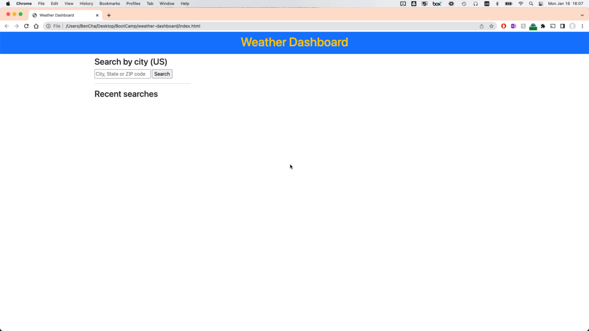

# Weather Dashboard

[Weather Dashboard](https://bencha27.github.io/weather-dashboard/) is a basic application for looking up weather forecast by location.

## Usage

- You can search by either city and state or ZIP code.
- The current weather will be displayed on top.
- The forecast for the next 5 days will be displayed on the bottom.
- Your 5 most recent searches will be saved and displayed on the side. You can click on a recent search to view the forecast for that location again.

## Demo

## Support

If you have any issues or questions, contact [Ben](mailto:mrbenjamincha@gmail.com).\
[GitHub](https://github.com/bencha27/weather-dashboard)
